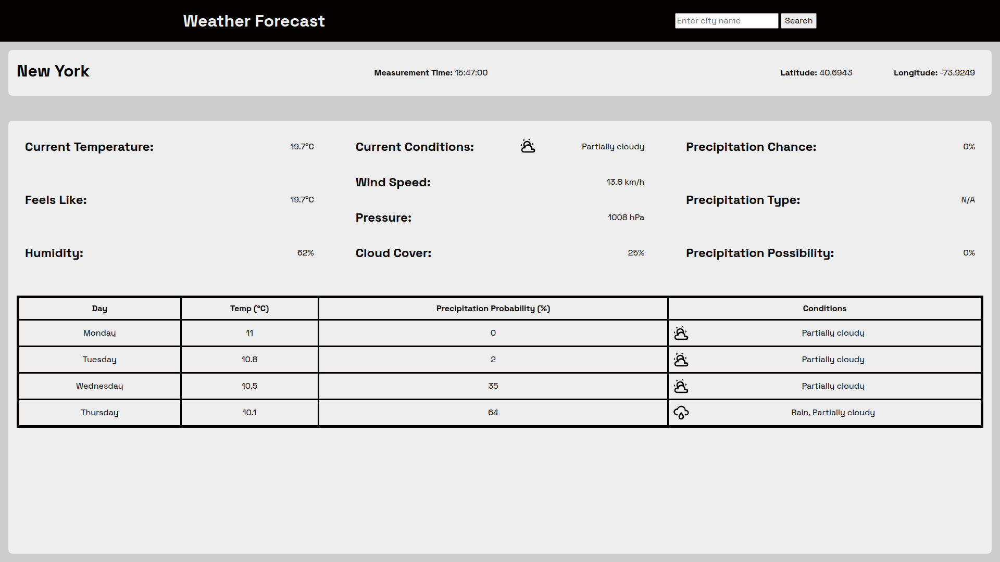

# Weather Forecast App

Project created for [Project Odin](https://www.theodinproject.com/lessons/node-path-javascript-weather-app)

## Features 

Input a name of a city into search bar to recieve information about current weather condition and forecast for the next few days.

**Information includes**:

- Latitude
- Longitude
- Measurement Time
- Current and Percieved  Temperature 
- Humidity 
- Current Sky Conditions and Cloud Coverage
- Wind Speed
- Pressure
- Current, Type of and Possibility of Precipitation

## Live Preview 

To see this website live click this [Link](https://devoid-of-thought.github.io/odin-weather-forecast/)